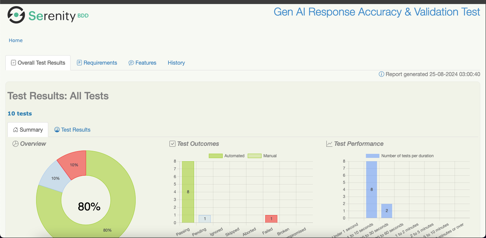

Generative AI Testing Project
Overview
Welcome to the Generative AI Testing Project! This project demonstrates how to test the accuracy of different Large Language Models (LLMs) using Java. It leverages various technologies to provide a robust framework for evaluating LLMs.

Tech Stack
Java: The primary programming language used for development.
Langchain4j: A library used to interface with generative AI models.
Serenity: A testing framework to support behavior-driven development (BDD) and automated testing.
Maven: A build management tool used for dependency management and project build.

Explanation
textToVector(String text):

Uses Lucene’s StandardAnalyzer to tokenize the text and create a term frequency map.
calculateCosineSimilarity(Map<String, Double> vectorA, Map<String, Double> vectorB):

Calculates cosine similarity between two term frequency vectors, ensuring that both vectors have the same dimensionality.
Handling Edge Cases:

Checks for zero norms to avoid division by zero errors.

Objectives
The main objective of this project is to offer insights and tools for assessing the accuracy of LLMs. This includes evaluating their responses against predefined criteria and generating reports on their performance.

Getting Started
To get started with this project, follow these steps:

Prerequisites
Java Development Kit (JDK): Ensure you have JDK 8 or higher installed.
Maven: Ensure you have Maven 3.6 or higher installed.
Installation
Clone the Repository

bash
Copy code
git clone https://github.com/rgupta95/GenAITesting.git
cd GenAITesting
Build the Project

mvn clean install
Run the Tests

mvn test
Usage
After building the project, you can run tests to evaluate LLM accuracy. The project includes sample test cases and configurations that can be customized according to your needs.

Contributing
Contributions are welcome! If you would like to contribute to this project, please follow these steps:

Fork the Repository.
Create a New Branch for your changes.
Commit Your Changes.
Push Your Branch to your forked repository.
Submit a Pull Request.
Please ensure that your code adheres to the project's coding standards and includes appropriate test coverage.

## License
[MIT License] (LICENSE)
This project is licensed under the GPL v3 License. See the LICENSE file for more details.

Contact
For any questions or feedback, please contact:

Name: Ranjan Kumar Gupta

Email: 89511ranjan@gmail.com

